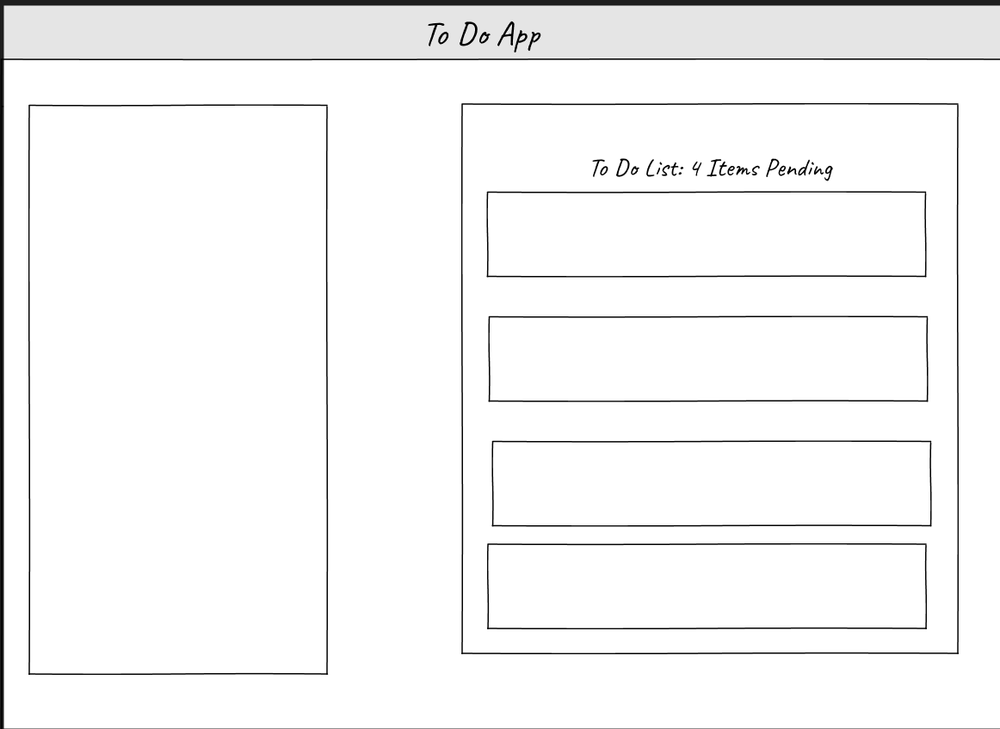

# LAB - TO-DO App

## Authors: Jeremy Cleland

## Problem Domain

### Phase 1 Requirements

- In Phase 1, we’re going to perform some refactoring of a Todo application built by another team. This application mixes application state and user settings at the top level and passes things around. It was a good proof of concept, but we need to make this production ready.

- #### Phase 1: Application Setup

  - Create a Detailed UML.
  - Properly modularize the application into separate components
  - Implement the Context API to make some basic application settings available to components.
    - Show three items by default.
    - Hide completed items by default.
    - Add the sort word ‘difficulty’ by default.
  - Style the application using the [Mantine Component API](https://mantine.dev/pages/getting-started/)

- ##### [Netlify-deployment](cleland-resty.netlify.app)

### Phase 2 Requirements

- #### Phase 2: Persistence

  - Implement a custom Form Hook.
  - Implement a custom Ajax Hook.
  - Connect to a live API for storing To Do Items.

### Phase 3 Requirements

- #### Phase 3: Settings and Global Context

  - Implement user settings for displaying items.

### Phase 4 Requirements

- #### Phase 4: Authorization

  - Require a login to access the list.
  - Restrict access to adding, editing, deleting to certain user types.

### Approach

- #### File Structure

    ├── .github
    │   ├── workflows
    │   │   └── node.yml
    ├── public
    ├── src
    │   ├── __tests__
    │   │   ├── App.test.jsx (integration test)
    │   ├── Components
    │   │   ├── Footer
    │   │   │   └── index.jsx
    │   │   ├── Header
    │   │   │   └── index.jsx
    │   │   ├── List
    │   │   │   └── index.jsx
    │   │   ├── Todo
    │   │   │   ├── index.jsx
    │   │   │   └── styles.scss  
    │   ├── Context
    │   │   ├── Settings
    │   │   │   ├── index.jsx
    │   │   │   └── Settings.test.jsx (unit test)
    │   ├── hooks
    │   │   ├── form.js
    │   │   └── styles.js (optional)
    │   ├── App.jsx
    │   └── index.js
    ├── .gitignore
    ├── package-lock.json
    ├── package.json
    └── README.md

- #### Global State

  - Describe how the global state is consumed by the components:

  - useForm():
  
### How to initialize/run your application (where applicable)

- `npm start`
- `nodemon`
- `node hub.js`
- `node index.js`

### Features / Routes

- GET
- POST
- PUT
- Delete

### Links and Resources

### UML

